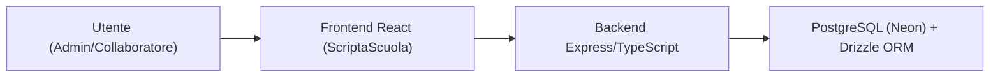

## ScriptaScuola

ScriptaScuola è un gestionale web pensato per **scuole e istituti scolastici** che vogliono digitalizzare e monitorare le **fotocopie effettuate da docenti e personale**, con:
- gestione dei **limiti di copie per docente**,
- tracciamento delle **registrazioni di copie** per utente,
- gestione di **utenti e ruoli** (admin, collaboratore),
- controllo centralizzato da parte dell’amministrazione.

Il progetto è strutturato come **monorepo** con tre workspace:
- `backend`: API REST in Node.js/Express + TypeScript, con PostgreSQL (Neon) e Drizzle ORM.
- `frontend`: interfaccia web in React/TypeScript con Vite, Tailwind/shadcn e TanStack Query.
- `shared`: logica di validazione condivisa tra backend e frontend (Zod).

### Indice

- [Architettura ad alto livello](#architettura-ad-alto-livello)
- [Stack tecnologico](#stack-tecnologico)
- [Come iniziare](#come-iniziare)
  - [Prerequisiti](#prerequisiti)
  - [Installazione](#installazione)
  - [Avvio backend](#avvio-backend)
  - [Avvio frontend](#avvio-frontend)
- [Documentazione dettagliata](#documentazione-dettagliata)

### Architettura ad alto livello



- **Frontend (ScriptaScuola UI)**: landing page, login/registrazione istituto, registrazione fotocopie, gestione docenti, gestione utenze, visualizzazione registrazioni, profilo utente.
- **Backend (ScriptaScuola API)**:
  - autenticazione (`/api/auth`) con JWT e refresh token (con rotazione),
  - gestione docenti (`/api/docenti`),
  - gestione utenti (`/api/utenti`),
  - registrazioni di copie (`/api/registrazioni-copie`),
  - gestione istituti (`/api/istituti`),
  - supporto multi‑tenant per istituto (`tenantStore`).

### Stack tecnologico

- **Linguaggi / runtime**
  - TypeScript
  - Node.js
  - React + Vite
- **Backend**
  - Express
  - PostgreSQL (Neon) con Drizzle ORM
  - Autenticazione JWT, hashing password con bcrypt
  - Validazione con Zod (tramite workspace `shared`)
  - Test di integrazione con Vitest + Supertest
- **Frontend**
  - React + React Router
  - Tailwind CSS, shadcn/UI, Base UI
  - TanStack Query / Form / Table
  - Integrazione con le API backend tramite HTTP client (es. Axios)

### Come iniziare

#### Prerequisiti

- Node.js (versione LTS recente)
- Accesso a un database PostgreSQL (ad es. Neon) e relativa connection string
- Git e un package manager (npm, pnpm o yarn)

#### Installazione

Nella root del progetto:

```bash
npm install
```

Questo installerà le dipendenze per `backend`, `frontend` e `shared` grazie ai workspace.

#### Avvio backend

Vedi dettagli e variabili d’ambiente in [`backend/README.md`](backend/README.md), in sintesi:

```bash
cd backend
npm run dev
```

#### Avvio frontend

Vedi dettagli in [`frontend/README.md`](frontend/README.md), in sintesi:

```bash
cd frontend
npm run dev
```

### Documentazione dettagliata

- [`backend/README.md`](backend/README.md): documentazione delle API ScriptaScuola (autenticazione, docenti, utenti, registrazioni copie), modello dati e setup backend.
- [`frontend/README.md`](frontend/README.md): documentazione dell’interfaccia ScriptaScuola, struttura delle pagine e integrazione con le API.


